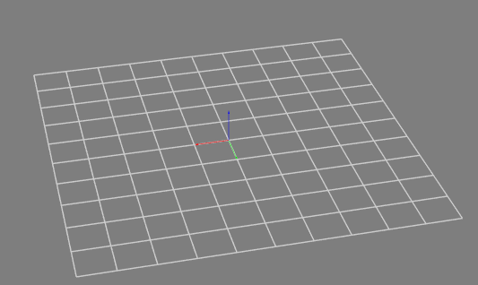

# vue-ros3djs



Vue components for [ros3djs](http://wiki.ros.org/ros3djs) with some extra functionality:
- Get pose of right-click / long-press
- [tween.js](https://github.com/tweenjs/tween.js/) integration for smooth transitions

## Install
```
npm install --save vue-ros3djs
```

## [Documentation](https://ldwgwffnschmdt.github.io/vue-ros3djs/)

## Usage

```javascript
<template>
  <ros3d-viewer :ros="ros" v-if="connected">
    <ros3d-axes />
    <ros3d-grid />

    <ros3d-laser-scan topic="/laserscan">
  </ros3d-viewer>
</template>

<script>
import ROSLIB from 'roslib';
import { Ros3dViewer, Ros3dGrid, Ros3dAxes, Ros3dLaserScan } from 'vue-ros3djs';

export default {
  name:  'VueRos3djsDemo',
  components: {
    Ros3dViewer,
    Ros3dGrid,
    Ros3dAxes,
    Ros3dLaserScan
  },
  data: () => ({
    ros: null,
    connected: false
  }),
  mounted() {
    this.ros = new ROSLIB.Ros({
      url : 'ws://localhost:9090'
    });

    this.ros.on('connection', () => {
      this.connected = true;
    });
  }
}
</script>
```
